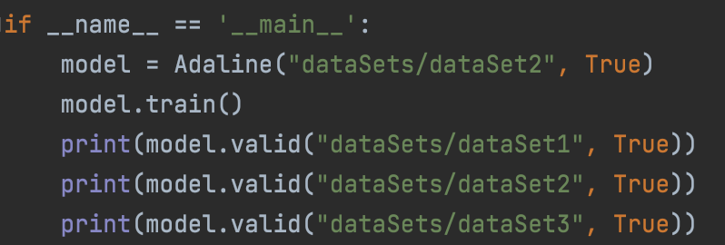
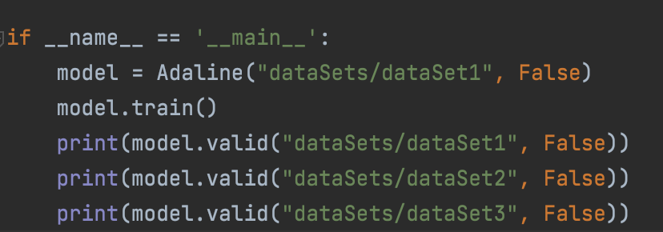
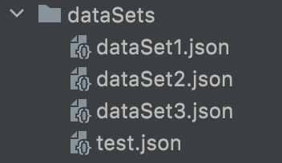

# NeuroComputation_Ex1

<!-- TABLE OF CONTENTS -->

  
Content

  <ol>
    <li><a href="#about-the-project">About The Project</a></li>
    <li><a href="#about-the-project">Plan and design of The Project</a></li>
    <li><a href="#how-to-run">How To Run</a></li>
    <li><a href="#the-algorithm">The Algorithm</a></li>
    <li><a href="#results">Results</a></li>
    <li><a href="#languages-and-tools">Languages and Tools</a></li>
    <li><a href="#contact">Contact</a></li>
  </ol>

<!-- ABOUT THE PROJECT -->
## About The Project

#### NeuroComputation 

***Authors : Lior Breitman & Yuval Sandler & Shauli Taragin & Ido Bar***  

In this project we implemented Adaline for training and testing neurones.

---------

## Plan and design of The Project

<li> The Adaline class:</li>
 

**The Adaline class members:**
* **Points -** Containing the dataset point after reading from json file.
* **W1 -** The final weight of X1.
* **W2 -** The final weight of X2. 
* **B -** Our bias.
* **Eps -** The value that we would want the MSE to be lower than.

**The Adaline class functions:**

1. **Train -** The main function that implements the Adaline algorithm and select the finale weights for x1 and x2.
2. **Test -** This function calculate the answers according to the given weight of x1 and x2 that has been chosen in the Train function.
3. **valid -** This function calls to the Test function and comparing the given results to the original results of the dataset.
Also it returns the precentage of the accuracy.
 
<li> General functions:</li>

* **createDataSet -** Create dataset of 1,000 points with values between -10,000 to 10,000.
* **saveDataSet -** Save the data into json file.
* **saveDataToCsv -** Given the values of each iteration it wrtie the values into csv table.

---------

<!-- HOW TO RUN -->
## How To Run

In order to run the algorithm you have to do three steps:
1. Create the Adaline object - Adaline("dataSets/dataSetName", condition)
2. Call the Train function - name_of_object.train()
3. Call the Valid function - name_of_object.valid("dataSets/dataSetName", condition)

For the condition you have two options:
1. True - Run the condition which says: if the Y_i > 1 then the value is 1, else -1.
2. False - Run the condition which says: if 4 <= (Y_i)^2 + (X_i)^2 <= 9 then the value is 1, else -1.

This image shows example of the code with False condition:

This image shows example of the code with False condition:

The list of datasets:

 

---------

<!-- The Algorithm  -->
## The Algorithm

First let’s define the variables:

*  - is the learning rate (some positive constant).

*  - the target.

*  - is the current output of the model.

*  - is the weight of the current neurone.

*  - some constant.

Steps:

1. Compute every y_i - 

2. Compute the new weights - .

3. Compute the new beta - .

4. Calculate the MSE - .

